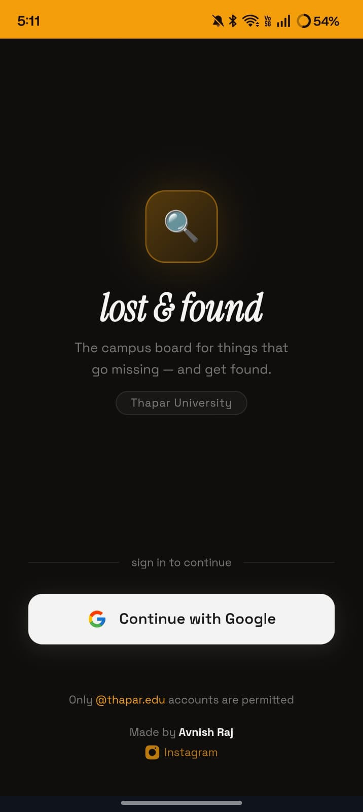
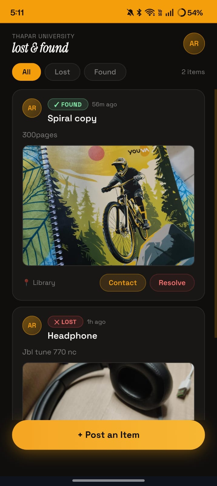
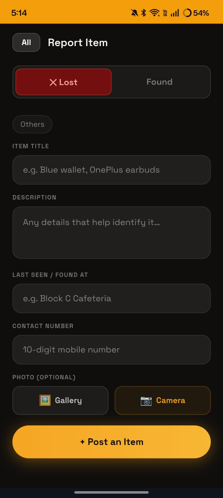

# 🔍 Lost & Found — Thapar University

A campus-exclusive Progressive Web App that helps Thapar students report and recover lost items using AI-powered matching and real-time notifications.

**Live App → [student-hub-wqat4.web.app](https://student-hub-wqat4.web.app)**

---

## The Problem

Students who lose items on campus have no efficient way to report them. Visiting the admin office is inconvenient, and emails often go unnoticed. Most students simply give up.

## The Solution

A dedicated platform where students can post lost/found items, get instantly notified when a potential match is found, and contact each other directly — all from their phone.

---

## Features

- **@thapar.edu login only** — Google Auth restricted to campus accounts
- **Post lost/found items** — title, description, category, location, photo
- **Real-time push notifications** — instant alerts for new matches
- **PWA** — installable on Android & iOS directly from the browser, no app store needed
- **Photo upload** — Cloudinary-backed image storage with client-side compression
- **Auto-expiry** — items expire after 3 days to keep the board clean
- **Admin moderation** — dedicated admin account to manage posts

---

## Tech Stack

| Layer | Technology |
|---|---|
| Frontend | HTML, CSS, Vanilla JS, Tailwind CSS |
| Auth | Firebase Authentication (Google) |
| Database | Cloud Firestore |
| Storage | Cloudinary |
| Hosting | Firebase Hosting |
| PWA | Service Worker, Web App Manifest |

---

## Screenshots

<p align="center">
  
  &nbsp;&nbsp;
  
  &nbsp;&nbsp;
  
</p>

---

## Getting Started

```bash
# Clone the repo
git clone https://github.com/AvnishR4j/Lost-Found.git
cd Lost-Found

# Install Firebase CLI (if not already)
npm install -g firebase-tools

# Deploy
firebase login
firebase deploy --only hosting
```

### Firebase Setup

1. Create a Firebase project at [console.firebase.google.com](https://console.firebase.google.com)
2. Enable **Google Authentication**
3. Create a **Firestore** database
4. Update `firebase.js` with your project config
5. Set Firestore rules to restrict access to authenticated users

### Cloudinary Setup

1. Create a free account at [cloudinary.com](https://cloudinary.com)
2. Create an **unsigned upload preset**
3. Update `CLOUDINARY_CLOUD` and `CLOUDINARY_PRESET` in `dashboard.js`

---

## Project Structure

```
Lost-Found/
├── index.html        # Login page
├── dashboard.html    # Main app (feed, post panel, notifications)
├── dashboard.js      # Firestore logic, matching engine, notifications
├── firebase.js       # Firebase config & initialization
├── sw.js             # Service worker (PWA offline support)
├── manifest.json     # PWA manifest
└── icon-*.png        # App icons
```

---

## Admin Access

Set `ADMIN_EMAILS` in `dashboard.js` to grant moderation privileges (delete any post, mark resolved).

---

## Author

**Avnish Raj**
B.E., Thapar Institute of Engineering & Technology
[avnish9569@gmail.com](mailto:avnish9569@gmail.com) · [GitHub](https://github.com/AvnishR4j)

---

> Built to solve a real campus problem. Contributions and feedback welcome.
